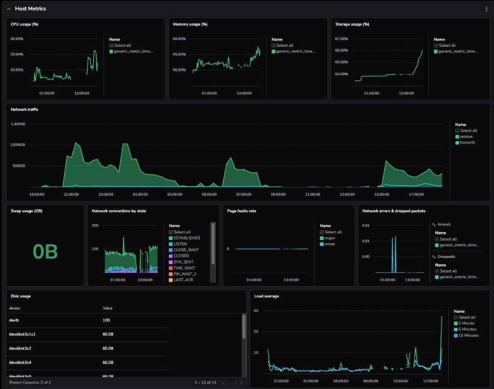

# macOS Host Metrics → Coralogix

Send real-time system metrics from any Mac to [Coralogix](https://coralogix.com) using the OpenTelemetry Collector. Includes a pre-built dashboard to visualize CPU, memory, disk, network, and process data.



---

## What you get

- **CPU** — utilization per core, load average (1m/5m/15m)
- **Memory** — used/free RAM, swap usage
- **Disk** — storage usage (%), total capacity, I/O read/write throughput
- **Network** — inbound/outbound traffic, dropped packets
- **Processes** — top processes by CPU and memory, with owner and command
- **Paging** — page fault operations over time

All metrics are tagged with your machine name so you can filter by machine in the dashboard when monitoring multiple Macs.

---

## Requirements

- macOS (Intel or Apple Silicon)
- A [Coralogix](https://coralogix.com) account with a **Send-Your-Data API key** (starts with `cxtp_`)

---

## Quick start

```bash
git clone https://github.com/kenan435/macos-metrics-coralogix.git
cd macos-metrics-coralogix
./install.sh
```

The installer will:
1. Download the OpenTelemetry Collector binary
2. Prompt you for a machine name and your Coralogix API key
3. Register the collector as a macOS LaunchAgent (runs automatically on login)

Metrics will appear in Coralogix within ~2 minutes.

---

## Dashboard setup

Import the pre-built dashboard into Coralogix:

```bash
export CORALOGIX_API_KEY="your-api-key"
./create-dashboard.sh
```

This creates the **Host Metrics** dashboard in your Coralogix account. It includes a **Machine** filter at the top so you can switch between machines if you have multiple Macs set up.

To update the dashboard after making changes to `dashboard-macbook-metrics.json`:

```bash
export CORALOGIX_API_KEY="your-api-key"
./update-dashboard.sh
```

---

## Managing the collector

```bash
# Check status
launchctl list | grep coralogix

# View logs
tail -f collector.log

# Stop
launchctl unload ~/Library/LaunchAgents/com.coralogix.otel-collector.plist

# Start
launchctl load ~/Library/LaunchAgents/com.coralogix.otel-collector.plist
```

### Uninstall

To stop the collector and remove it from login startup:

```bash
./uninstall-service.sh
```

To also delete the binary and repo:

```bash
./uninstall-service.sh
rm -rf /path/to/macos-metrics-coralogix
```

---

## How it works

```
Mac system metrics
      │
      ▼
OpenTelemetry Collector (otelcol-contrib)
  • hostmetrics receiver  ← scrapes CPU, memory, disk, network, processes
  • resource processor    ← tags with machine name + environment
  • batch processor       ← buffers before sending
      │
      ▼
Coralogix (OTLP/gRPC)
      │
      ▼
Host Metrics Dashboard
```

The collector runs as a background LaunchAgent, scraping metrics every 30 seconds and shipping them to Coralogix over OTLP.

---

## Files

| File | Purpose |
|------|---------|
| `config.yaml` | OTel Collector config (receivers, processors, exporters) |
| `com.coralogix.otel-collector.plist` | LaunchAgent template (populated by `install.sh`) |
| `install.sh` | One-command installer for macOS |
| `uninstall-service.sh` | Removes the collector and LaunchAgent |
| `dashboard-macbook-metrics.json` | Coralogix dashboard definition |
| `create-dashboard.sh` | Creates the dashboard via Coralogix API |
| `update-dashboard.sh` | Updates an existing dashboard via Coralogix API |
